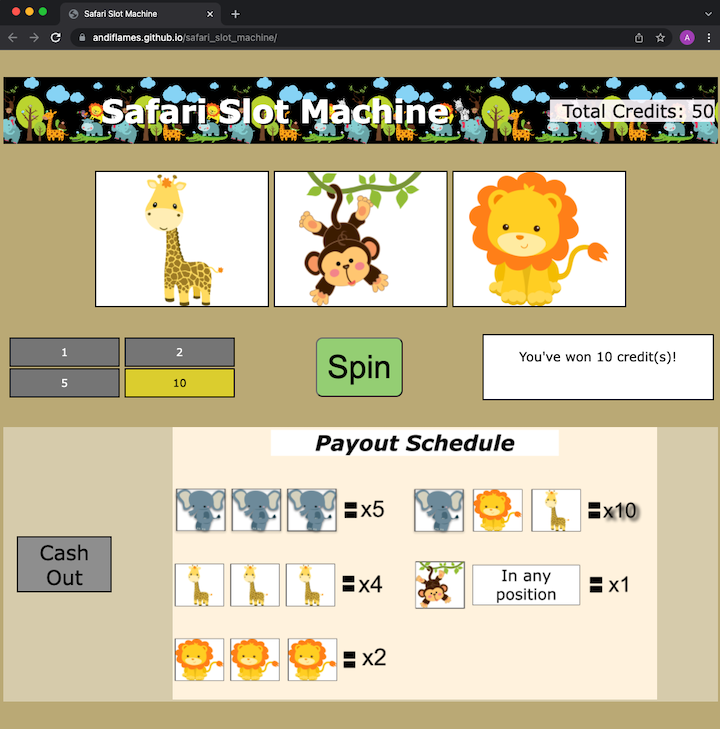

# safari_slot_machine

## Description
This is a simple project to create a web-app game. I have chosen to make a slot machine, but with a safari theme! The player will be given credits to start, then
be able to make bets and spin to either win big, or lose it all!

## Brief Example

## Features
- Slots!
- Animals!
- Gambling!

## Technologies
This project is made by using HTML, CSS, and JavaScript

## Getting Started
- To play the game click  
- Fork the repo, then load the index.html page in a browser.

## Contribution
This is a school project, so no external contributions are needed