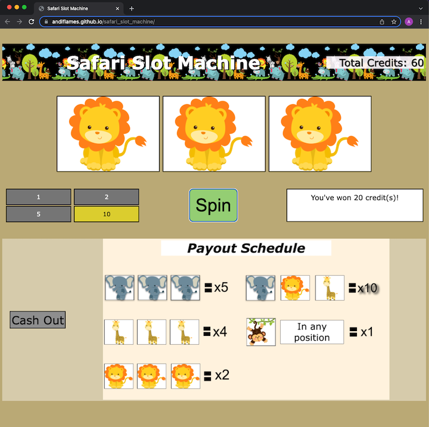

# safari_slot_machine

## Description
This is a simple project to create a web-app game. I have chosen to make a slot machine, but with a safari theme! The player will be given credits to start, then
be able to make bets and spin to either win big, or lose it all!

## Brief Example

## Features
- Slots!
- Animals!
- Gambling!

## Technologies
This project is made by using HTML, CSS, and JavaScript

## Getting Started
- To play the game click [Safari Slot Machine](https://andiflames.github.io/safari_slot_machine/).
- Or, fork and clone the repo, then load the html page in a browser.

#### Rules of the Game
- Player starts with 50 credits.
- First player places a bet by clicking on either the 1, 2, 5, and 10 box, underneath the spinners. The active bet's background will be a goldish color. **Note: the active bet is, automatically, set to 1**.
- Then push the Spin button
- The spinners will then rotate and stop on a set of safari animal images.
- Depending on the spinners combination, player will either loss the amound that was betted or win back the amount placed by multplying the bet shown in the [Payout Schedule](./images/payout_schedule.png).

## Next Steps
- Add sound effects to the Spin button (onced clicked) and spinners (when rotating).
- Set different times for each spinner to stop rotating.
- Update the results to print out the phrase without having to use `credit(s)` in the string.

### Contribution
This is a school project, so no external contributions are needed